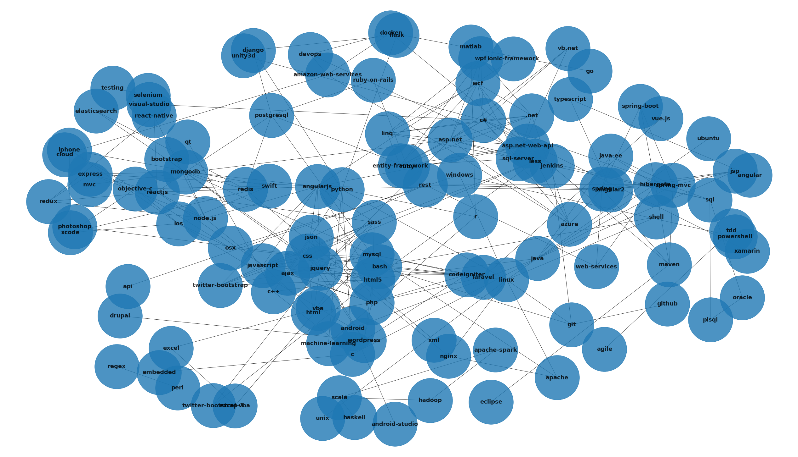
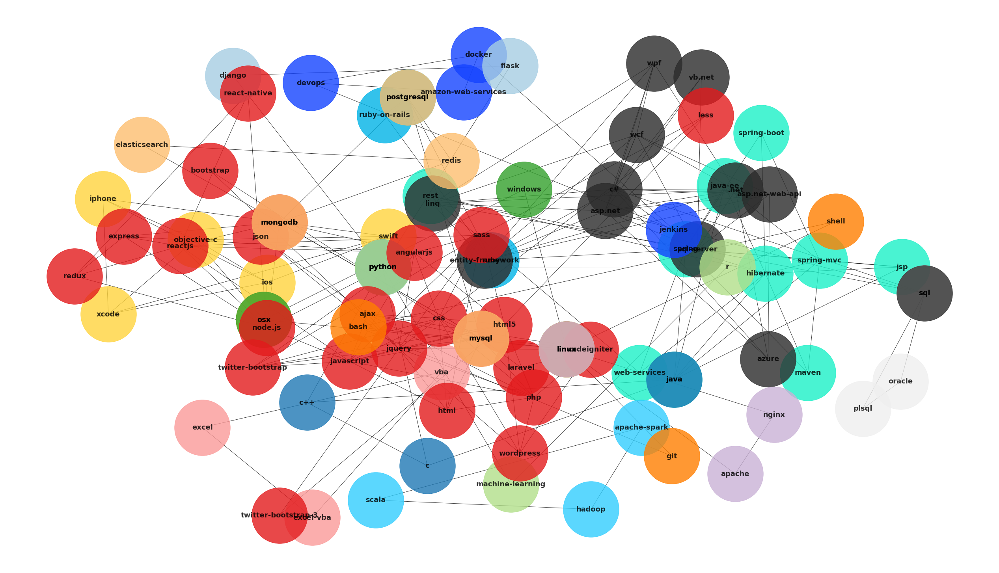
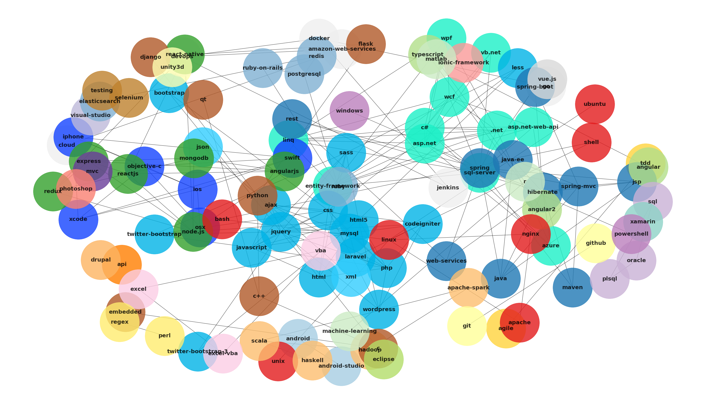
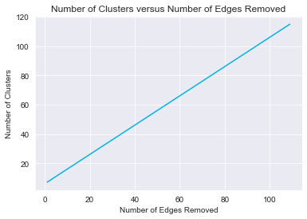
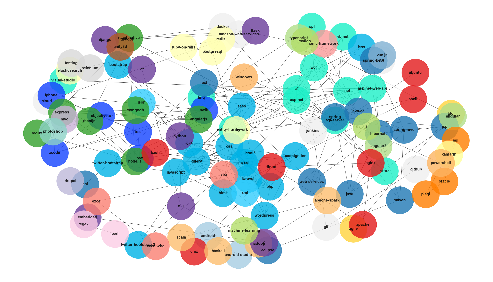

# Network Clustering - Lab

## Introduction

In this lab you'll practice your clustering and visualization skills to investigate stackoverflow! Specifically, the dataset you'll be investigating examines tags on stackoverflow. With this, you should be able to explore some of the related technologies currently in use by developers.

## Objectives

In this lab you will: 

- Make visualizations of clusters and gain insights about how the clusters have formed

## Load the Dataset

Load the data from the `'stack-overflow-tag-network/stack_network_links.csv'` file. For now, simply load the file as a standard pandas DataFrame.


```python
import pandas as pd
df = pd.read_csv('stack-overflow-tag-network/stack_network_links.csv')
df.head()
```


<div>
<style scoped>
    .dataframe tbody tr th:only-of-type {
        vertical-align: middle;
    }

    .dataframe tbody tr th {
        vertical-align: top;
    }

    .dataframe thead th {
        text-align: right;
    }
</style>
<table border="1" class="dataframe">
  <thead>
    <tr style="text-align: right;">
      <th></th>
      <th>source</th>
      <th>target</th>
      <th>value</th>
    </tr>
  </thead>
  <tbody>
    <tr>
      <th>0</th>
      <td>azure</td>
      <td>.net</td>
      <td>20.933192</td>
    </tr>
    <tr>
      <th>1</th>
      <td>sql-server</td>
      <td>.net</td>
      <td>32.322524</td>
    </tr>
    <tr>
      <th>2</th>
      <td>asp.net</td>
      <td>.net</td>
      <td>48.407030</td>
    </tr>
    <tr>
      <th>3</th>
      <td>entity-framework</td>
      <td>.net</td>
      <td>24.370903</td>
    </tr>
    <tr>
      <th>4</th>
      <td>wpf</td>
      <td>.net</td>
      <td>32.350925</td>
    </tr>
  </tbody>
</table>
</div>


## Transform the Dataset into a Network Graph using NetworkX

Transform the dataset from a Pandas DataFrame into a NetworkX graph.


```python
import networkx as nx

G = nx.Graph()
for row in df.index:
    source = df.source[row]
    target = df.target[row]
    weight = df.value[row]
    G.add_edge(source, target, weight=weight)
print(len(G.nodes))
```

    115


## Create an Initial Graph Visualization

Next, create an initial visualization of the network.


```python
import matplotlib.pyplot as plt
%matplotlib inline

plt.figure(figsize=(35,20))
nx.draw(G, pos=nx.spring_layout(G, k=2, seed=10), with_labels=True,
        alpha=.8, node_size=20000, font_weight='bold', font_size=18)
```

    //anaconda3/lib/python3.7/site-packages/networkx/drawing/nx_pylab.py:579: MatplotlibDeprecationWarning: 
    The iterable function was deprecated in Matplotlib 3.1 and will be removed in 3.3. Use np.iterable instead.
      if not cb.iterable(width):





## Perform an Initial Clustering using k-clique Clustering

Begin to explore the impact of using different values of k.


```python
for i in range(2,6):
    kc_clusters = list(nx.algorithms.community.k_clique_communities(G, k=i))
    print('With k={}, {} clusters form.'.format(i, len(kc_clusters)))
```

    With k=2, 6 clusters form.
    With k=3, 16 clusters form.
    With k=4, 5 clusters form.
    With k=5, 5 clusters form.


## Visualize The Clusters Produced from the K-Clique Algorithm

> **Level-Up:** Experiment with different `nx.draw()` settings. See the [draw documentation here](https://networkx.github.io/documentation/networkx-1.10/reference/generated/networkx.drawing.nx_pylab.draw_networkx.html) for a full list. Some recommended settings that you've previewed include the position parameter `pos`, `with_labels=True`, `node_color`, `alpha`, `node_size`, `font_weight` and `font_size`. Note that `nx.spring_layout(G)` is particularly useful for laying out a well formed network. With this, you can pass in parameters for the relative edge distance via `k` and set a `random_seed` to have reproducible results as in `nx.spring_layout(G, k=2.66, seed=10)`. For more details, see the [spring_layout documentation here](https://networkx.github.io/documentation/networkx-1.10/reference/generated/networkx.drawing.layout.spring_layout.html?highlight=spring%20layout#networkx.drawing.layout.spring_layout).


```python
colors = [('teal', '#1cf0c7'),
         ('workzone_yellow', '#ffd43d'),
         ('light-blue', '#00b3e6'),
         ('medium-blue', '#32cefe'),
         ('gray', '#efefef'),
         ('dark-blue', '#1443ff')]
color_dict = dict(colors)

fig = plt.figure(figsize=(35,20))
for n, ci in enumerate(kc_clusters):
    ci = G.subgraph(ci)
    nx.draw(ci, pos=nx.spring_layout(G, k=2, seed=10), with_labels=True, node_color=colors[n%len(colors)][1],
            alpha=0.8, node_size=20000, font_weight='bold', font_size=18)
```


```python
kc_clusters = list(nx.algorithms.community.k_clique_communities(G, k=3))
colors = ['#1cf0c7','#ffd43d','#00b3e6','#32cefe','#efefef','#2b2b2b', '#1443ff',
          '#a6cee3','#1f78b4','#b2df8a','#33a02c','#fb9a99','#e31a1c',
          '#fdbf6f','#ff7f00','#cab2d6','#6a3d9a','#ffff99','#b15928']
fig = plt.figure(figsize=(35,20))
for n, ci in enumerate(kc_clusters):
    ci = G.subgraph(ci)
    nx.draw(ci, pos=nx.spring_layout(G, k=2.5, seed=10), with_labels=True, node_color=colors[n],
            alpha=0.8, node_size=20000, font_weight='bold', font_size=18)
```


## Perform an Alternative Clustering Using the Girvan-Newman Algorithm

Recluster the network using the Girvan-Newman algorithm. Remember that this will give you a list of cluster lists corresponding to the clusters that from removing the top $n$ edges according to some metric, typically edge betweenness.


```python
gn_clusters = list(nx.algorithms.community.centrality.girvan_newman(G))
for n, clusters in enumerate(gn_clusters):
    print('After removing {} edges, there are {} clusters.'.format(n, len(clusters))) 
```

    After removing 0 edges, there are 7 clusters.
    After removing 1 edges, there are 8 clusters.
    After removing 2 edges, there are 9 clusters.
    After removing 3 edges, there are 10 clusters.
    After removing 4 edges, there are 11 clusters.
    After removing 5 edges, there are 12 clusters.
    After removing 6 edges, there are 13 clusters.
    After removing 7 edges, there are 14 clusters.
    After removing 8 edges, there are 15 clusters.
    After removing 9 edges, there are 16 clusters.
    After removing 10 edges, there are 17 clusters.
    After removing 11 edges, there are 18 clusters.
    After removing 12 edges, there are 19 clusters.
    After removing 13 edges, there are 20 clusters.
    After removing 14 edges, there are 21 clusters.
    After removing 15 edges, there are 22 clusters.
    After removing 16 edges, there are 23 clusters.
    After removing 17 edges, there are 24 clusters.
    After removing 18 edges, there are 25 clusters.
    After removing 19 edges, there are 26 clusters.
    After removing 20 edges, there are 27 clusters.
    After removing 21 edges, there are 28 clusters.
    After removing 22 edges, there are 29 clusters.
    After removing 23 edges, there are 30 clusters.
    After removing 24 edges, there are 31 clusters.
    After removing 25 edges, there are 32 clusters.
    After removing 26 edges, there are 33 clusters.
    After removing 27 edges, there are 34 clusters.
    After removing 28 edges, there are 35 clusters.
    After removing 29 edges, there are 36 clusters.
    After removing 30 edges, there are 37 clusters.
    After removing 31 edges, there are 38 clusters.
    After removing 32 edges, there are 39 clusters.
    After removing 33 edges, there are 40 clusters.
    After removing 34 edges, there are 41 clusters.
    After removing 35 edges, there are 42 clusters.
    After removing 36 edges, there are 43 clusters.
    After removing 37 edges, there are 44 clusters.
    After removing 38 edges, there are 45 clusters.
    After removing 39 edges, there are 46 clusters.
    After removing 40 edges, there are 47 clusters.
    After removing 41 edges, there are 48 clusters.
    After removing 42 edges, there are 49 clusters.
    After removing 43 edges, there are 50 clusters.
    After removing 44 edges, there are 51 clusters.
    After removing 45 edges, there are 52 clusters.
    After removing 46 edges, there are 53 clusters.
    After removing 47 edges, there are 54 clusters.
    After removing 48 edges, there are 55 clusters.
    After removing 49 edges, there are 56 clusters.
    After removing 50 edges, there are 57 clusters.
    After removing 51 edges, there are 58 clusters.
    After removing 52 edges, there are 59 clusters.
    After removing 53 edges, there are 60 clusters.
    After removing 54 edges, there are 61 clusters.
    After removing 55 edges, there are 62 clusters.
    After removing 56 edges, there are 63 clusters.
    After removing 57 edges, there are 64 clusters.
    After removing 58 edges, there are 65 clusters.
    After removing 59 edges, there are 66 clusters.
    After removing 60 edges, there are 67 clusters.
    After removing 61 edges, there are 68 clusters.
    After removing 62 edges, there are 69 clusters.
    After removing 63 edges, there are 70 clusters.
    After removing 64 edges, there are 71 clusters.
    After removing 65 edges, there are 72 clusters.
    After removing 66 edges, there are 73 clusters.
    After removing 67 edges, there are 74 clusters.
    After removing 68 edges, there are 75 clusters.
    After removing 69 edges, there are 76 clusters.
    After removing 70 edges, there are 77 clusters.
    After removing 71 edges, there are 78 clusters.
    After removing 72 edges, there are 79 clusters.
    After removing 73 edges, there are 80 clusters.
    After removing 74 edges, there are 81 clusters.
    After removing 75 edges, there are 82 clusters.
    After removing 76 edges, there are 83 clusters.
    After removing 77 edges, there are 84 clusters.
    After removing 78 edges, there are 85 clusters.
    After removing 79 edges, there are 86 clusters.
    After removing 80 edges, there are 87 clusters.
    After removing 81 edges, there are 88 clusters.
    After removing 82 edges, there are 89 clusters.
    After removing 83 edges, there are 90 clusters.
    After removing 84 edges, there are 91 clusters.
    After removing 85 edges, there are 92 clusters.
    After removing 86 edges, there are 93 clusters.
    After removing 87 edges, there are 94 clusters.
    After removing 88 edges, there are 95 clusters.
    After removing 89 edges, there are 96 clusters.
    After removing 90 edges, there are 97 clusters.
    After removing 91 edges, there are 98 clusters.
    After removing 92 edges, there are 99 clusters.
    After removing 93 edges, there are 100 clusters.
    After removing 94 edges, there are 101 clusters.
    After removing 95 edges, there are 102 clusters.
    After removing 96 edges, there are 103 clusters.
    After removing 97 edges, there are 104 clusters.
    After removing 98 edges, there are 105 clusters.
    After removing 99 edges, there are 106 clusters.
    After removing 100 edges, there are 107 clusters.
    After removing 101 edges, there are 108 clusters.
    After removing 102 edges, there are 109 clusters.
    After removing 103 edges, there are 110 clusters.
    After removing 104 edges, there are 111 clusters.
    After removing 105 edges, there are 112 clusters.
    After removing 106 edges, there are 113 clusters.
    After removing 107 edges, there are 114 clusters.
    After removing 108 edges, there are 115 clusters.


## Create a Visualization Wrapper

Now that you have an idea of how splintered the network becomes based on the number of edges removed, you'll want to examine some of the subsequent groups that gradually break apart. Since the network is quiet complex to start with, using subplots is not a great option; each subplot would be too small to accurately read. Create a visualization function `plot_girvan_newman(G, clusters)` which takes a NetworkX graph object as well as one of the clusters from the output of the Girvan-Newman algorithm above and plots the network with a unique color for each cluster.

> **Level-Up:** Experiment with different `nx.draw()` settings. See the [draw documentation here](https://networkx.github.io/documentation/networkx-1.10/reference/generated/networkx.drawing.nx_pylab.draw_networkx.html) for a full list. Some recommended settings that you've previewed include the position parameter `pos`, `with_labels=True`, `node_color`, `alpha`, `node_size`, `font_weight` and `font_size`. Note that `nx.spring_layout(G)` is particularly useful for laying out a well formed network. With this, you can pass in parameters for the relative edge distance via `k` and set a `random_seed` to have reproducible results as in `nx.spring_layout(G, k=2.66, seed=10)`. For more details, see the [spring_layout documentation here](https://networkx.github.io/documentation/networkx-1.10/reference/generated/networkx.drawing.layout.spring_layout.html?highlight=spring%20layout#networkx.drawing.layout.spring_layout).


```python
def plot_girvan_newman(G, clusters):
    fig = plt.figure(figsize=(35,20))
    colors = ['#1cf0c7','#ffd43d','#00b3e6','#32cefe','#efefef',
          '#1443ff','#a6cee3','#1f78b4','#b2df8a','#33a02c','#fb9a99',
          '#e31a1c','#fdbf6f','#ff7f00','#cab2d6','#6a3d9a','#ffff99',
          '#b15928','#8dd3c7','#ffffb3','#bebada','#fb8072','#80b1d3',
          '#fdb462','#b3de69','#fccde5','#d9d9d9','#bc80bd','#ccebc5',
          '#ffed6f','#bf812d','#dfc27d','#f6e8c3','#f5f5f5','#c7eae5',
          '#80cdc1', '#35978f', '#01665e', '#003c30']
    for n , c in enumerate(clusters):
        ci = G.subgraph(c)
        # Other recommend random_seed choices are 3,7, 10, K value of 2.5 also seem to work well
        nx.draw(ci, pos=nx.spring_layout(G, k=2.66, seed=10), with_labels=True, node_color=colors[n],
                alpha=0.8, node_size=20000, font_weight='bold', font_size=20)
    plt.show()
```

## Visualize the Various Clusters that Form Throughout the Girvan-Newman Algorithm

Use your function to visualize the various clusters that form throughout the Girvan-Newman algorithm as you remove more and more edges from the network.


```python
plot_girvan_newman(G, gn_clusters[5])
```





```python
plot_girvan_newman(G, gn_clusters[15])
```


```python
plot_girvan_newman(G, gn_clusters[24])
```





## Cluster Decay Rate

Create a visual to help yourself understand the rate at which clusters of this network formed versus the number of edges removed.

> **Level-Up**: Based on your graphic, what would you predict is an appropriate number of clusters? 


```python
import seaborn as sns
sns.set_style('darkgrid')

y = [len(cluster) for cluster in gn_clusters]
x = [n+1 for n in range(len(gn_clusters))]
plt.plot(x,y, color='#00b3e6')
plt.title('Number of Clusters versus Number of Edges Removed')
plt.ylabel('Number of Clusters')
plt.xlabel('Number of Edges Removed')
plt.show()
```





```python
# While an initial investigation such as the one above does not appear to be particularly informative,
# exploring additional cluster metrics reveals more interesting patterns.
import numpy as np

fig = plt.figure(figsize=(12,10))

max_cluster_size = [max([len(c) for c in cluster]) for cluster in gn_clusters]
plt.plot(x,max_cluster_size, color=colors[0], label='Max Cluster Size')

min_cluster_size = [min([len(c) for c in cluster]) for cluster in gn_clusters]
plt.plot(x,min_cluster_size, color=colors[1], label='Minimum Cluster Size')

mean_cluster_size = [np.mean([len(c) for c in cluster]) for cluster in gn_clusters]
plt.plot(x,mean_cluster_size, color=colors[2], label='Mean Cluster Size')

median_cluster_size = [np.median([len(c) for c in cluster]) for cluster in gn_clusters]
plt.plot(x,median_cluster_size, color=colors[3], label='Median Cluster Size')

single_node_clusters = [sum([1 if len(c)==1 else 0 for c in cluster]) for cluster in gn_clusters]
plt.plot(x,single_node_clusters, color=colors[6], label='Number of Single Node Clusters')

small_clusters = [sum([1 if len(c)<=5 else 0 for c in cluster ]) for cluster in gn_clusters]
plt.plot(x,small_clusters, color=colors[5], label='Number of Small Clusters (5 or less nodes)')

plt.legend(loc=(1.01,.75), fontsize=14)
plt.title('Cluster Size Metrics versus Number of Edges Removed', fontsize=14)
plt.xlabel('Number of Edges Removed', fontsize=14)
plt.ylabel('Cluster Metric')
plt.ylim(0,80)
plt.yticks(ticks=list(range(0,80,5)))
plt.show()
```


## Choose a Clustering 

Now that you have generated various clusters within the overall network, which do you think is the most appropriate or informative?


```python
print('Number of clusters:',len(gn_clusters[20]))
plot_girvan_newman(G, gn_clusters[20])
# This clustering representation was chosen after analyzing the plots above.
# After the 20th edge is removed, max cluster size does not drastically drop again,
# while small and single node clusters start to rapidly spawn. K-Clique clusters did not appear to be well developed.
```

    Number of clusters: 27


    //anaconda3/lib/python3.7/site-packages/networkx/drawing/nx_pylab.py:579: MatplotlibDeprecationWarning: 
    The iterable function was deprecated in Matplotlib 3.1 and will be removed in 3.3. Use np.iterable instead.
      if not cb.iterable(width):





```python
# While there is no definitive criteria for optimizing clusters, 
# there is almost a 33% increase in the total number clusters here,
# yet the same definitive clusters jump to the eye as above.
# For this reason, it can be argued that the above clusters are more definitive and representative.
print('Number of clusters:',len(gn_clusters[32]))
plot_girvan_newman(G, gn_clusters[32])
```

    Number of clusters: 39


## Summary

In this lab you practice using the k-clique and Girvan-Newman methods for clustering. Additionally, you may have also gotten a better sense of some of the current technological landscape. As you can start to see, network clustering provides you with powerful tools to further subset large networks into smaller constituencies allowing you to dig deeper into their particular characteristics.
